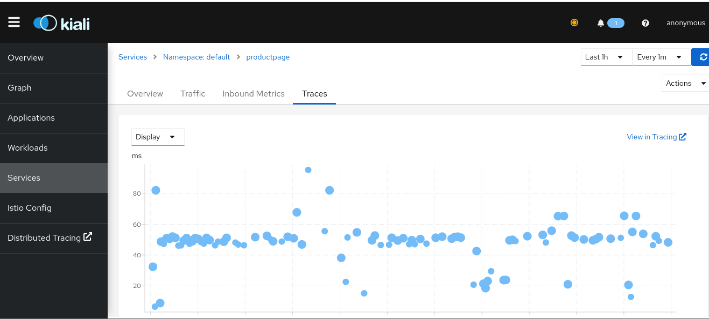

# POC Kiali + Grafana Tempo

This repository is a PoC to test the usage of [Kiali](https://kiali.io/) + [Grafana Tempo](https://grafana.com/oss/tempo/).

## Explanation
The `deploy-all` will:
1. Downloads all the needed tools
1. Starts a [kind](https://kind.sigs.k8s.io/) Kubernetes cluster
1. Deploys [`istio`](https://istio.io/) in the cluster
1. Deploys the `[bookinfo](https://istio.io/latest/docs/examples/bookinfo/)` application
1. Deploys the [Prometheus integration with Istio](https://istio.io/latest/docs/ops/integrations/prometheus/)
1. Deploys Grafana Tempo following [the official documentation](https://grafana.com/docs/tempo/latest/setup/tanka/) using a `minio` instance
    > **Note**
    > The script `hack/install-tempo.sh` does almost all the deployment. Some values are different than in the official documentation to: reduce the number of needed resources (for the development environment), expose the `16685` port from the Jaeger Query service and expose the ports for the different protocols to consume

1. Deploys Kiali from `config/kiali.yaml`.
    > **Note**
    >This configuration is the one from the [official Istio documentation](https://istio.io/latest/docs/ops/integrations/kiali/#option-1-quick-start) but changing the values for `.external_services.tracing.in_cluster_url` and `.external_services.tracing.url` from the Kiali configuration.

This approach was proposed [by @kvrhdn in this comment](https://github.com/kiali/kiali/issues/4278#issuecomment-980638393).

# Instructions

1. Deploy the cluster and configurations
    ```sh
    $ make deploy-all
    ```
1. Do port forwarding to acces the Kiali UI:

    ```sh
    $ kubectl port-forward service/kiali 20001 -n istio-system
    ```
1. Access the `http://localhost:20001` URL in your browser.
1. Do port forwarding to the `productpage` service:
    ```sh
    $ kubectl port-forward service/productpage 9080
    ```
1. Generate some traces:
    ```sh
    $ while true; do; curl -s localhost:9080/productpage; done
    ```
1. Check the traces in the Kiali UI
    
1. The Jaeger UI is available in `http://localhost`
